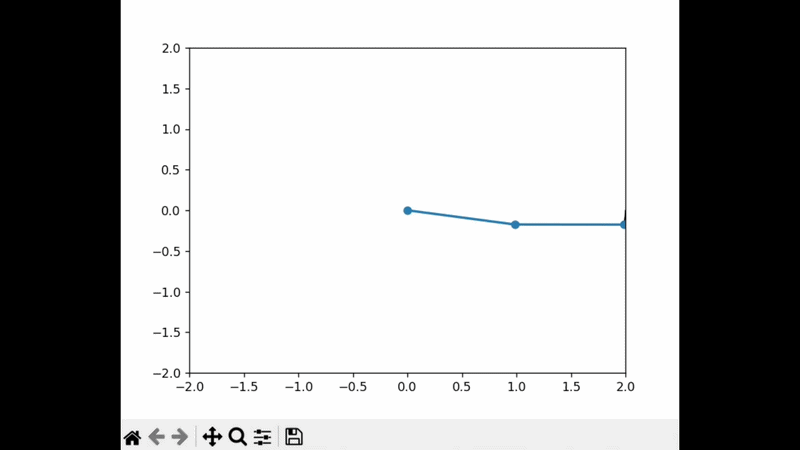

# Double Pendulum Simulator

A physics-based simulation of a double pendulum demonstrating chaotic motion.

## Features
- Real-time simulation
- Adjustable parameters (length, mass, gravity)
- Visual trajectory tracking

## How It Works
This simulator models a double pendulum using numerical methods to solve the equations of motion. The system exhibits chaotic behavior, meaning small changes in initial conditions lead to drastically different outcomes.

## How to Run
1. Install Python
2. Install dependencies:
   pip install pygame numpy
3. Run:
   python main.py

## Dependencies
Install required packages:
pip install -r requirements.txt

## Simulation Demo

## Future Improvements
- Add UI controls
- Export simulation data
- Mobile app version
